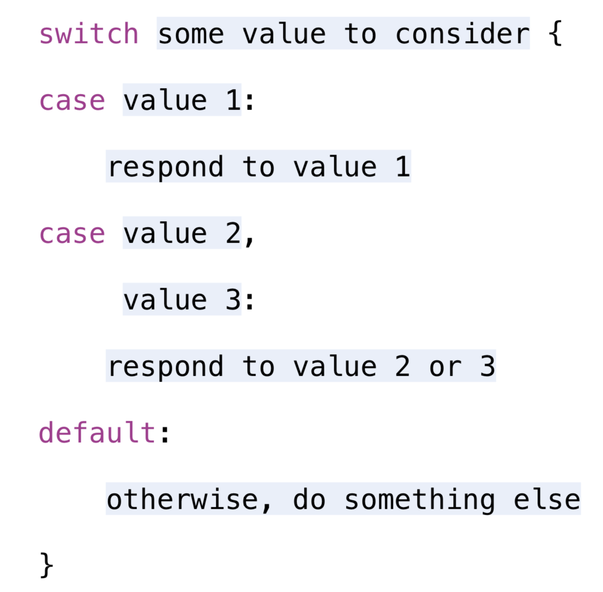

# 2017.01.16
## 1. 조건문이란
- 함수 내부에서 실행되는 선택문
- 조건문으로는 if-else / switch-case

## 2. 조건문 선언

### 1) if
> 

### 2) switch
> 

## 3. 각종 연산자
- +, -, *, /, % : 산술 연산자
- ==, >, <, >=, <= : 비교 연산자
- &&, ||, ! : 논리 연산자
- 각각의 연산자의 설명은 설명이 잘 정리된 블로그 주소를 남깁니다 
> [연산자 설명보러가기](https://xho95.github.io/swift/language/grammar/basic/operators/2016/04/27/Basic-Operators.html)

## 4. Swift의 switch
- 스위프트에서는 스위치에 조금 더 많은 기능을 제공해준다.
- where와 튜플을 이용하면 switch를 조금 더 유용하게 사용할 수 있다.

~~~
    func leap(year : Int) -> Bool {
        switch year {
        case year where year % 100 == 0 && year % 400 == 0 || year % 100 != 0 && year % 4 == 0:
            return true
        default:
            return false
        }
    }
    
    /// 년도와 월을 입력 받으면 해당월의 마지막날이 몇일 인지 리턴해주는 함수(윤년을 고려해서)
    /// 년도를 입력 받으면 윤년인지 구해 주는 함수를 호출해서 판단 후 yearAndMonth에 (윤년일시 true 아닐시 false를 입력해주고, 현재월)
    /// - Parameters:
    ///   - year: 년도를 입력받는다
    ///   - month: 월을 입력받는다
    /// - Returns: 마지막 일자를 리턴받는다
    func lastDayChange(year : Int, month : Int) -> Int {
        let yearAndMonth = (leap(year: year), month)
        switch yearAndMonth {
        case (false, 2):
            return 28
        case (true, 2):
            return 29
        // _ : 다른월들은 윤년의 영향을 받지 않으므로 와일드카드를 사용하여 x를 생략해준다
        // y에 값을 넣어주고 where을 이용해 조건들을 비교하여 참이면 30일을 표시해주고 아닐시 31일을 표시
        case (_, let y) where y < 7 && y % 2 == 0 || y > 8 && y % 2 == 1:
            return 30
        default:
            return 31
        }
    }
~~~

## 5. 조건문관련 실습 과제
- [if문 과제](https://github.com/wargi/SangWookPark_IOS_School6/blob/master/Practice/IfConditional/IfConditional/IfConditional.swift)
- [switch문 과제](https://github.com/wargi/SangWookPark_IOS_School6/blob/master/Practice/SwitchConditional/SwitchConditional/SwitchConditional.swift)